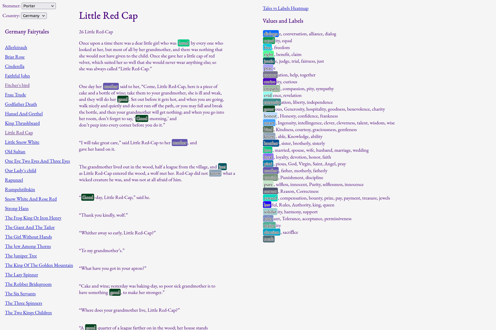

# moreever
MulticORpus Explorer for Explicit ValuE References

This is a tool to visually explore (for the sake of comparison) the presence of clusters of textual references in several corpora.
This is meant to work with small corpora. That's why lemmatisation/stemming is supported. For currently supported stemmers, see stemmers.py.

## Setup
Corpora are loaded in the stories directory, with each corpus represented by a subdirectory. Currently these are fixed (see const.py, create.py,...). If not in possesion of corpora, use PD-scrape.ipynb to download fairy tales.

Values are defined in a CSV-like file, where each line starts with the value representant, followed by label/keywords (synonyms) separated by commas. An example is provided in values-edited.txt.

## Use
Running deploy.py generates a static website to browse the texts with the values highlighter. To run locally, use site/run.sh

## Screenshots

